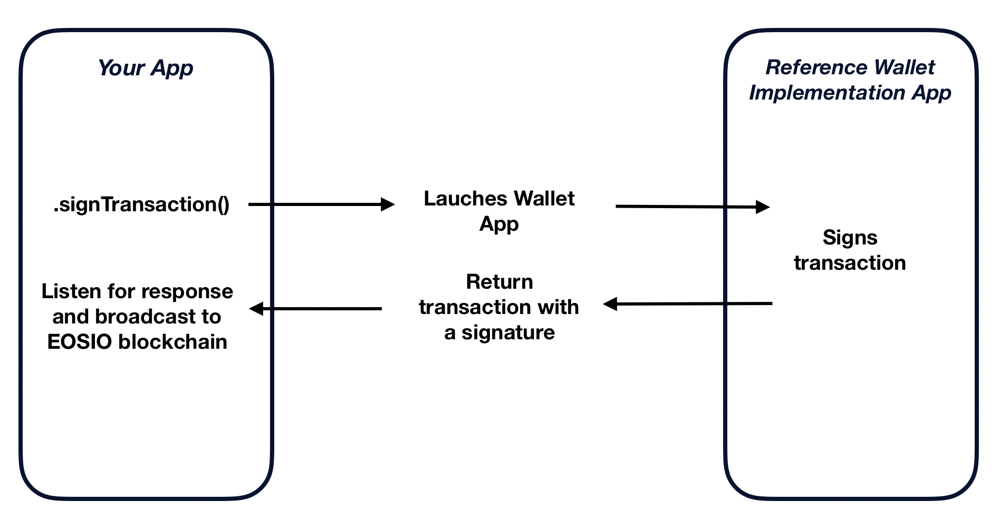

# EOSIO SDK for Swift: iOS Reference wallet/signature provider 

The Signature Provider abstraction is arguably the most useful of all of the [EOSIO SDK for Swift](https://github.com/EOSIO/eosio-swift) providers. It is responsible for:

* finding out what keys are available for signing (`getAvailableKeys`), and
* requesting and obtaining transaction signatures with a subset of the available keys (`signTransaction`).

By simply switching out the signature provider on a transaction, signature requests can be routed any number of ways. Need a signature from keys in the platform's Keychain or Secure Enclave? Configure the `EosioTransaction` with a conforming signature provider that exposes that functionality. Need signatures from a wallet on the user's device? A signature provider can do that too!

All signature providers must conform to the [EosioSignatureProviderProtocol](https://github.com/EOSIO/eosio-swift/blob/master/EosioSwift/EosioSignatureProviderProtocol/EosioSignatureProviderProtocol.swift) Protocol.

*All product and company names are trademarks™ or registered® trademarks of their respective holders. Use of them does not imply any affiliation with or endorsement by them.*

## Contents
- [Prerequisites](#prerequisites)
- [Installation](#installation)
- [Basic Usage](#basic-usage)
- [Want to Help?](#want-to-help)
- [License & Legal](#license)

## Prerequisites

* Xcode 10 or higher
* CocoaPods 1.5.3 or higher
* For iOS, iOS 11+

## Installation
This reference wallet/signature provider has [EOSIO SDK for Swift](https://github.com/EOSIO/eosio-swift) as a dependency.

1. Clone the library to your machine
2. Navigate to the project folder using `Terminal`
3. Run `pod install`
4. Open newly created file `EosioReferenceWalletSignatureProvider.xcworkspace`

## Basic Usage

Kick off a signature request from Reference Wallet Implementation App by calling `signTransaction`.
It will use [deep link](https://developer.apple.com/ios/universal-links/) communication channel to activate the Reference Wallet Implementation App and pass the transaction details.
Once the transaction is signed by Reference Wallet Implementation App, it will kick back to your app and pass the transaction with signature(s).
You just need to listen to it at `didFinishLaunchingWithOptions` of your `AppDelegate` and consume it.

**Note:** When you try to request signatues for the first time, the flow will be a little different. Your app will display a `selective disclosure` to the user asking for permission to request public keys from the Reference Wallet Implementation app.

## Want to help?

Interested in contributing? That's awesome! Here are some [Contribution Guidelines](./CONTRIBUTING.md) and the [Code of Conduct](./CONTRIBUTING.md#conduct).

## License

[MIT](./LICENSE)

## Important

See LICENSE for copyright and license terms.  Block.one makes its contribution on a voluntary basis as a member of the EOSIO community and is not responsible for ensuring the overall performance of the software or any related applications.  We make no representation, warranty, guarantee or undertaking in respect of the software or any related documentation, whether expressed or implied, including but not limited to the warranties or merchantability, fitness for a particular purpose and noninfringement. In no event shall we be liable for any claim, damages or other liability, whether in an action of contract, tort or otherwise, arising from, out of or in connection with the software or documentation or the use or other dealings in the software or documentation.  Any test results or performance figures are indicative and will not reflect performance under all conditions.  Any reference to any third party or third-party product, service or other resource is not an endorsement or recommendation by Block.one.  We are not responsible, and disclaim any and all responsibility and liability, for your use of or reliance on any of these resources. Third-party resources may be updated, changed or terminated at any time, so the information here may be out of date or inaccurate.

Wallets and related components are complex software that require the highest levels of security.  If incorrectly built or used, they may compromise users’ private keys and digital assets. Wallet applications and related components should undergo thorough security evaluations before being used.  Only experienced developers should work with this software.
